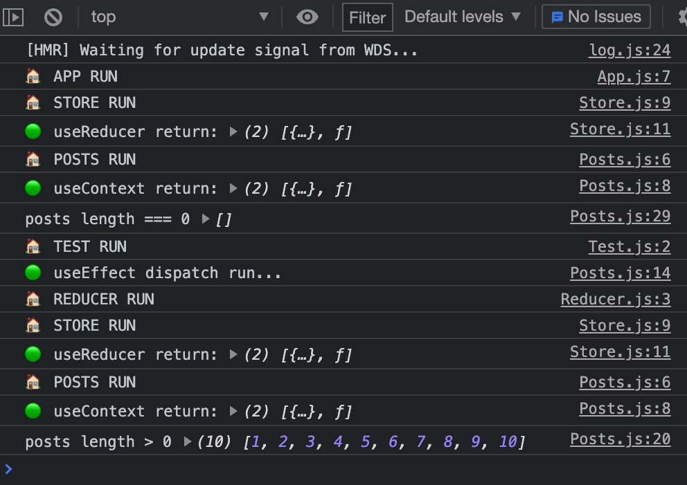

# react state management practice

create-react-app that saves and renders a list of dummy data on page load using Context and useReducer hooks. 

## what happens: 

1. App component runs
1. Store component runs, useReducer uses empty initial state, and deconstructs into array of empty state and dispatch function
1. Provider passes state and dispatch values to children (array of all components wrapped in the Store component)
1. Post component runs, useContext imports & deconstructs current state and dispatch values
1. Post displays 0 initial posts
1. useEffect dispatch runs once (with action and dummyData), which runs reducer, which updates Store with new state, which updates relevant children (Posts)
1. Post component useContext deconstructs into updated state (and same dispatch), and displays updated posts